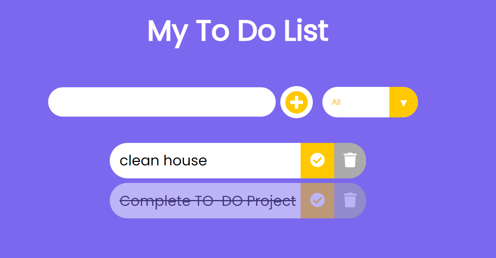

# TO-DO-lIST-APP
A simple To-Do List web application built using HTML, CSS, and JavaScript. This application allows users to add, manage, and delete tasks with a user-friendly interface.



## Features

- Add tasks to your to-do list.
- Mark tasks as completed.
- Delete tasks you no longer need.
- Filter tasks by status (All, Completed, Incomplete).
- Store your tasks locally, so they persist after a page refresh.

## Usage

1. Clone the repository to your local machine:

   ```shell
   git clone https://github.com/meabhi2206/TO-DO-lIST-APP.git

2. Open the `index.html` file in your web browser to run the application.

## How to Use
* Enter a task in the input field and click the `"+"` button or press `Enter` to add it to the list.
* Click the checkmark icon to mark a task as completed or incomplete.
* Click the trash icon to delete a task.
* Use the filter dropdown to view tasks by status (All, Completed, Incomplete).
* Your tasks are saved locally in your browser, so they'll persist even after you close the browser.

## Customize
You can easily customize the application by modifying the HTML, CSS, and JavaScript files to suit your needs.

## Technologies Used
* HTML
* CSS
* JavaScript

## License
This project is open-source and available under the MIT License. See LICENSE for details.

## About
Built by Abhishek.

## Support or Contact
If you have any questions or need assistance, please contact `ranjanabhishek904@gmail.com`

Feel free to raise issues or suggest improvements. 
Enjoy using the To-Do List app!
